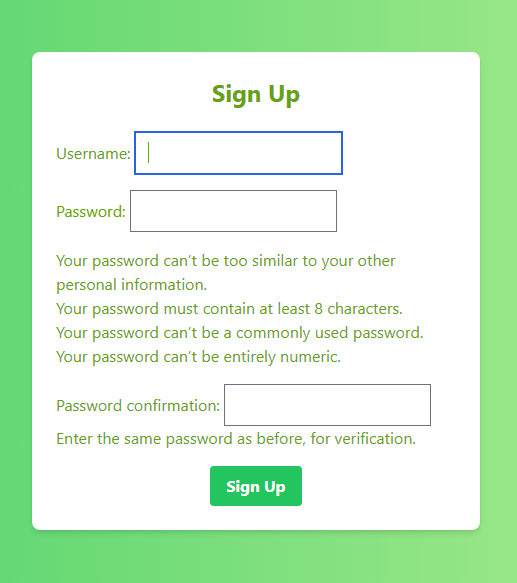
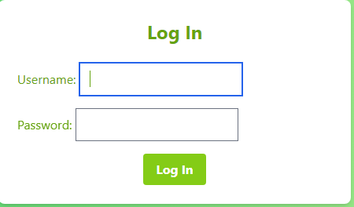
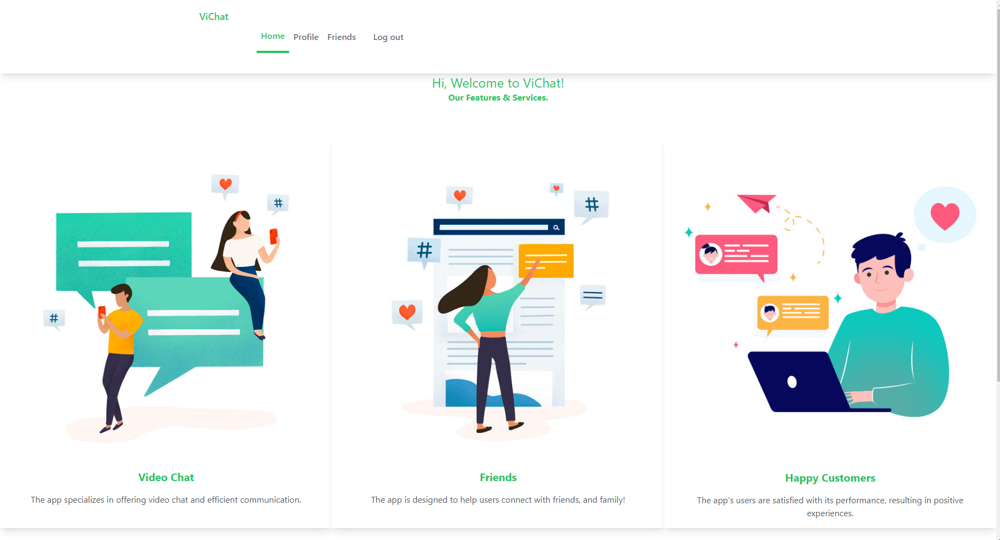
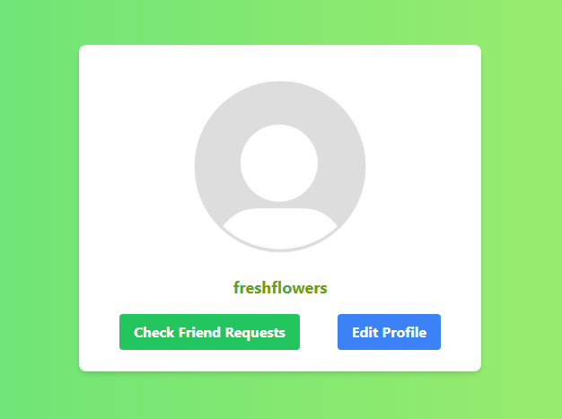
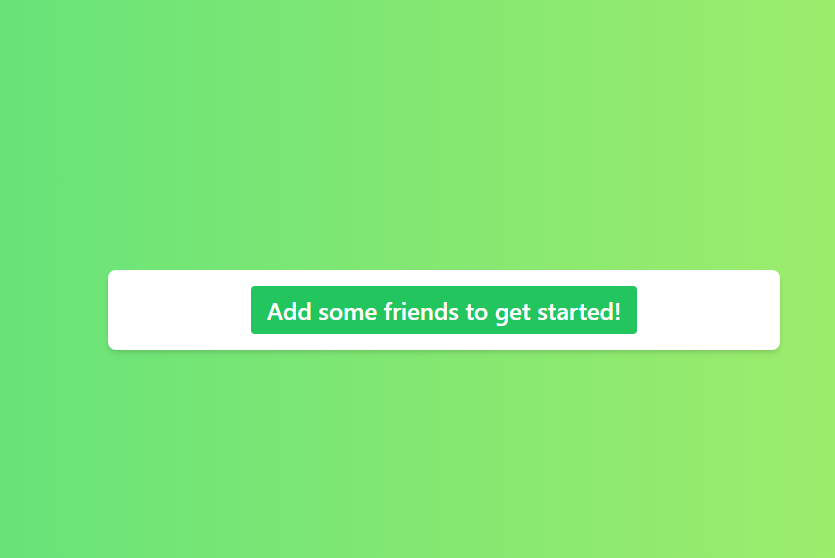
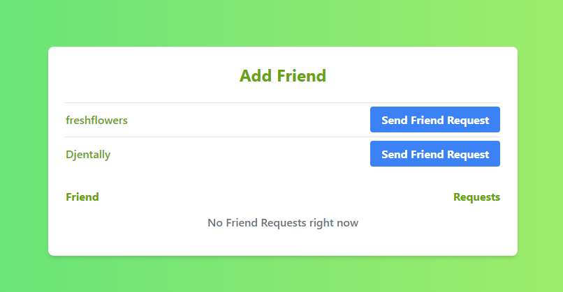
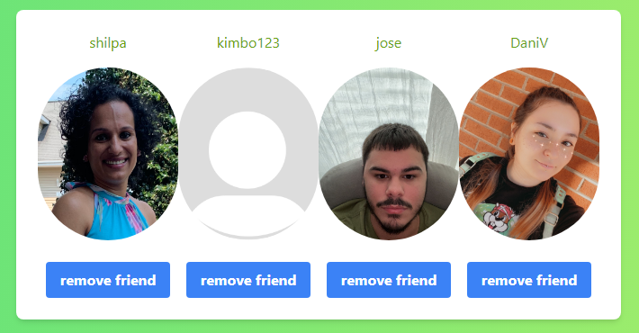

# Vichat
## A. Description
   Vichat is a full-stack web application that provides a facility for the user to add contacts to their friends' list and do a video call with them from their device.
   
Developed by: 
- **Anthony Scott** - Researcher, Back End, Agora, Trello
- **Jose Aguirre** - Project Manager, Designer, Frontend, Pitch-Deck
- **Shilpa Sivarajan** - Git Owner, Back End, Documentation, Front End
   
## B. User Stories
```
   As a user I would like to have a friends list
	 
   As a user I want to be able to upload a profile picture
	 
   As a user I would like to able to send friend requests to other users
	 
   As a user I want to have a profile that I can edit
	 
   As a user I want to be able to join a meeting room
	 
   As a user I want to be able to do a group video call
	 
   As a user I want to be able to turn off my camera
	 
   As a user I want to be able to mute my mic
	 
   As a user I want to be to call someone directly from my friends list
   
   As a user I want to be able to remove a friend
 ```     
## C. Images








## D. Technologies Used
### Front End
```
1. HTML
2. CSS
3. JavaScript
4. Tailwind
```
### Back End
```
1. Django 
2. Python
4. Agora SDK
```
### Cloud Based Services
```
1. Heroku
2. AWS
```
### Planning and Organization
```
1. Trello
2. Lucidchart
3. MockFlow
```


## E. Getting Started
Click on [ViChat](https://vichat-messaging-app.herokuapp.com/) to start using this app. 
1) ### Home Page 
	- From the Home Page, a user must sign up from the home page and then log in. 
2) ### Friends page
	- Then the user can go to the friends page where they can check if there are any friends' request. If there are friends' request they can accept it if they want to. 
	- From here the user can click on a friend to call them. 

[Trello](https://trello.com/b/Bmb9slUC/vichat)
[Pitch-Deck](https://docs.google.com/presentation/d/1GbR_fqQisto-ir7I3y6MpyYkky7ufAgbPJGofFDB11w/edit?usp=sharing)

## F. Next Steps
```
As a user I would like to be able to private message my friends
As a user I want to be able to see people's profiles before sending a friend request
```			
